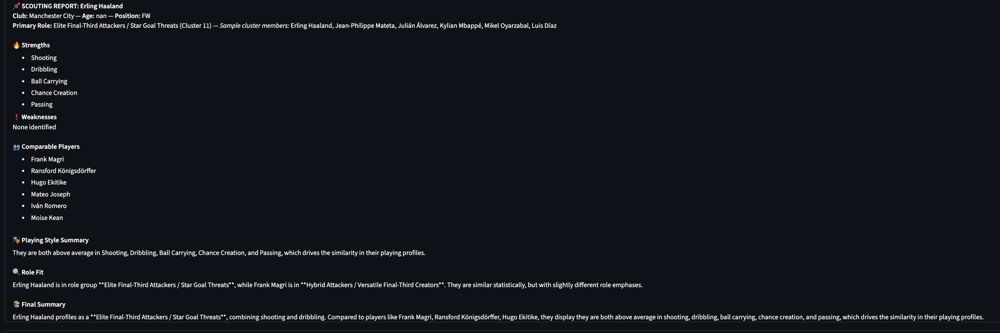
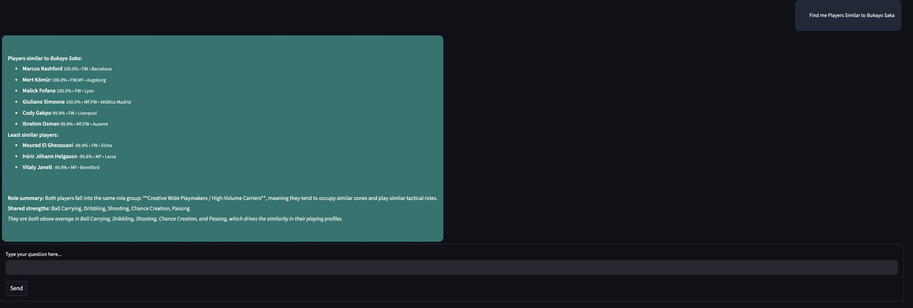
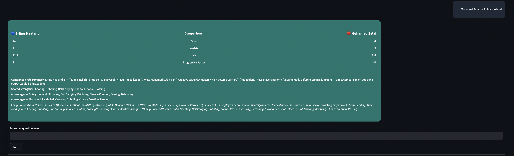
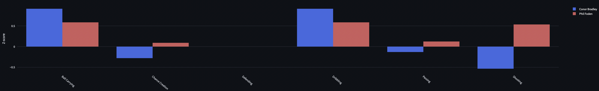
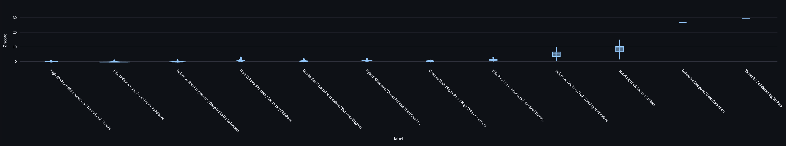

**Soccer-Scouting-Bot**

A conversational soccer scouting assistant built in Python with a Streamlit front-end. It helps analysts and scouts discover player profiles, find similar playing styles, run role-aware player comparisons, and generate short automated scouting reports using FBref-derived event statistics.

**Project Overview**
- **What it does:** Provides an interactive chat-style UI to lookup players, run similarity searches, perform role-aware comparisons, and produce short scouting reports.
- **Key capabilities:**
	- Player lookups with fuzzy matching and metadata extraction
	- Embedding-based similarity search (StandardScaler → PCA → KMeans → cosine similarity)
	- Frozen cluster labels that describe tactical role archetypes
	- Role-aware comparison engine that applies a role sanity-check before comparing stats
	- Automated hunting of strengths / weaknesses and short scouting reports
	- Conversational NLP surface: entity extraction + intent classification to map natural queries to actions

**Features**
- **Player profiles & radar charts:** compact profile cards with percentile-style radar visualizations.
- **Similarity engine:** embedding pipeline and nearest-neighbor ranking for players with explanation support.
- **Comparison engine:** role-aware comparisons that prefer role-based context over naive stat comparisons.
- **Scouting report generator:** short HTML/markdown reports summarizing role, strengths, weaknesses, and comparables.
- **NLP pipeline:** lightweight entity extraction and layered intent classifier (pattern + weighted-keywords + optional ML fallback).
- **Admin tooling:** UI and CLI utilities for editing and freezing cluster label mappings (`src/app/admin_clusters.py`, `src/modeling/freeze_clusters.py`).
- **Graceful fallbacks:** app runs with limited features when optional models are missing (training & heavy deps are optional).

**System Architecture**

- Data pipeline: raw FBref scrapers → cleaned CSVs under `data/processed/` → per-feature z-scores → model training
- Embedding pipeline: select numeric features → `StandardScaler` → `PCA` to produce dense embeddings → `KMeans` (role clusters)
- Runtime components:
	- Similarity + explanation: cosine similarity on embeddings + feature-wise z-score analysis
	- Comparison engine: role-sanity check → feature-level contrasts → textual summary
	- Scouting generator: collates metadata, strengths/weaknesses, comparable players and renders markdown/HTML
- UI: Streamlit app at `src/app/app.py` (main), `src/app/admin_clusters.py` (admin)
- Persisted artifacts: `data/models/player_embedding_model.pkl` (embedding model), `data/models/similarity_model.pkl` (legacy scaler+knn)

**Frontend**

The Streamlit frontend (`src/app/app.py`) provides a conversational UI with several visual components. Below are screenshots and visual assets used in the app (files under the `images/` directory).

- Chat & main UI (input, message bubbles, profile cards):

	

- Alternate UI views and panels:

	
	
	

- Cluster overview (KMeans clusters + sample members):

	

- Z-score distributions used for radar/feature normalization:

	

- Similarity / heatmap visual (top-k similarity matrix):

	

- Feature similarity illustration used in explanations:

	

Notes:
- Images are included for quick reference in this README; they are stored in the repository under `images/`.
- To replace screenshots, overwrite the corresponding `images/*.png` file and the README will render the updated image.

**High-level Folder Tree (sample)**

```
/ (repo root)
├─ data/
│  ├─ processed/
│  │  ├─ all_leagues_clean.csv
│  │  ├─ outfield_clean.csv
│  │  └─ z_scores.csv
│  └─ models/
│     ├─ player_embedding_model.pkl
│     └─ similarity_model.pkl
├─ src/
│  ├─ app/
│  │  ├─ app.py
│  │  └─ admin_clusters.py
│  ├─ modeling/
│  │  ├─ similarity.py
│  │  ├─ train_player_embedding.py
+│  │  └─ compare.py
│  ├─ nlp/
│  │  ├─ entity_extraction.py
│  │  └─ intent_classifier.py
│  ├─ player/
│  │  ├─ lookup.py
│  │  └─ extract.py
│  ├─ preprocessing/
│  └─ scraping/
└─ README.md
```

**Installation & Setup**

1. Clone the repository:

```bash
git clone https://github.com/shuklashreyas/Soccer-Scouting-Bot.git
cd Soccer-Scouting-Bot
```

2. Create and activate a virtual environment (zsh):

```bash
python -m venv .venv
source .venv/bin/activate
```

3. Install dependencies:

```bash
pip install -r requirements.txt
```

4. Run the Streamlit app (development):

```bash
streamlit run src/app/app.py
```

System notes
- Recommended Python: 3.10+ (project tested against 3.10/3.11)
- Optional system deps: ChromeDriver (for Selenium-based scrapers), and system BLAS/LAPACK for fast numpy/scipy builds if training locally.

**How the Model Works**

- Feature engineering:
	- Uses FBref-derived per-player statistics; where possible metrics are normalized to per-90 values and converted to numeric.
	- A separate pre-processing step computes per-feature z-scores (see `data/processed/z_scores.csv`) used for similarity and cluster-level summaries.

- Embedding model (PlayerEmbeddingModel):
	- Input: selected numeric feature columns (z-score style features preferred).
	- Pipeline: `StandardScaler` → `PCA` to produce dense embeddings → `KMeans` to derive role cluster ids.
	- Outputs: scaled X (`X_scaled`), embeddings, `role_labels`, and a `role_cluster` column written into the model's dataframe.

- Role clusters & frozen labels:
	- Clusters are grouped by unsupervised KMeans and can be annotated with human labels.
	- Admin tools allow freezing these labels (so retrains won't change friendly names unexpectedly).

- Similarity search:
	- Cosine similarity on embedding vectors; top-k neighbors returned.
	- When an embedding model is not available, a legacy `scaler+knn` artifact (`similarity_model.pkl`) is supported.

- Comparison logic:
	- A role-sanity check (`role_check.py`) decides whether a stat-wise comparison is fair or whether a role-oriented explanation is more appropriate.
	- Numeric contrasts are computed in z-score space and summarized into human-friendly advantages/disadvantages.

- Radar charts:
	- Per-feature percentile ranks are computed against the dataset and plotted as a 0–100 scale radar (mplsoccer).

**NLP Module**

- Entity extraction (`src/nlp/entity_extraction.py`): lightweight string matching to find player names, leagues, and stat keywords from a curated list.
- Intent classification (`src/nlp/intent_classifier.py`): layered approach:
	- Pattern rules for precise constructs ("A vs B", "players like X")
	- Weighted-keyword scoring for broad intents (stats / compare / similar / league fit)
	- Optional ML fallback: if pre-trained vectorizer + classifier artifacts exist under `data/models`, they are used.

Query flow example
- Query: "Find me players like Haaland"
	- Entity extractor resolves `Haaland` → intent classifier returns `similar_players` → embedding similarity engine called → app renders top-k similar players plus a short role-style explanation.

**Usage Examples**

- "Tell me about Erling Haaland"
	- Returns a profile card with key stats, role label, strengths/weaknesses, and a radar chart of percentile features.

- "Compare Gakpo and Saka"
	- Runs role-sanity check then shows a side-by-side table of core stats plus an NLP-style comparison paragraph and feature-by-feature contrasts.

- "Give me players similar to Declan Rice"
	- Returns a ranked list of similar players (top-k), with similarity scores and a short style/role summary.

**Admin Tools**

- `src/app/admin_clusters.py` — Streamlit admin page to edit and persist human-friendly labels for clusters in a `player_embedding_model.pkl`.
- `src/modeling/freeze_clusters.py` — CLI helpers to list clusters, export a JSON template, and apply a mapping to a saved model.

Workflow to update labels
1. Launch `admin_clusters.py` via Streamlit or run `freeze_clusters.py template` to generate a JSON.
2. Edit the JSON labels and either apply via the CLI or upload/save using the admin UI.
3. Persisted mapping is saved inside the pickled model so label lookups are stable.

**Limitations**

- Data: only event-level FBref data is used (no tracking/positional event streams). This constrains some style assessments.
- Comparability: defenders and goalkeepers often require different metrics — direct comparisons with attackers can be misleading; the engine attempts to detect and surface this.
- Entity resolution: player name resolution is fuzzy but still relies on reasonable spelling and canonical names in `all_leagues_clean.csv`.
- League-fit: current league-fit logic is a simple heuristic placeholder (planned as Milestone 3).

**Future Work**

- Trained league-fit models using transfer/league outcome data.
- Multi-season and time-aware embeddings.
- Integrate tracking data for richer defensive and off-ball metrics.
- Use retrieval-augmented generation (RAG) to create richer style descriptions and scouting prose.
- Improve defender-specific features and per-role evaluation metrics.

**Citation & Acknowledgements**

- Data source: FBref (https://fbref.com) — please observe FBref terms of use when scraping or publishing data.
- This project is a portfolio tool — credit for any research foundations should be added as appropriate.

**License**

This repository ships with a permissive MIT-style license by default.

```
MIT License

Copyright (c) 2025 [Your Name]

Permission is hereby granted, free of charge, to any person obtaining a copy
of this software and associated documentation files (the "Software"), to deal
in the Software without restriction, including without limitation the rights
to use, copy, modify, merge, publish, distribute, sublicense, and/or sell
copies of the Software, and to permit persons to whom the Software is
furnished to do so, subject to the following conditions:

THE SOFTWARE IS PROVIDED "AS IS", WITHOUT WARRANTY OF ANY KIND, EXPRESS OR
IMPLIED, INCLUDING BUT NOT LIMITED TO THE WARRANTIES OF MERCHANTABILITY,
FITNESS FOR A PARTICULAR PURPOSE AND NONINFRINGEMENT.
```


