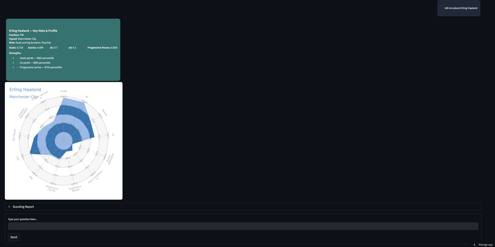
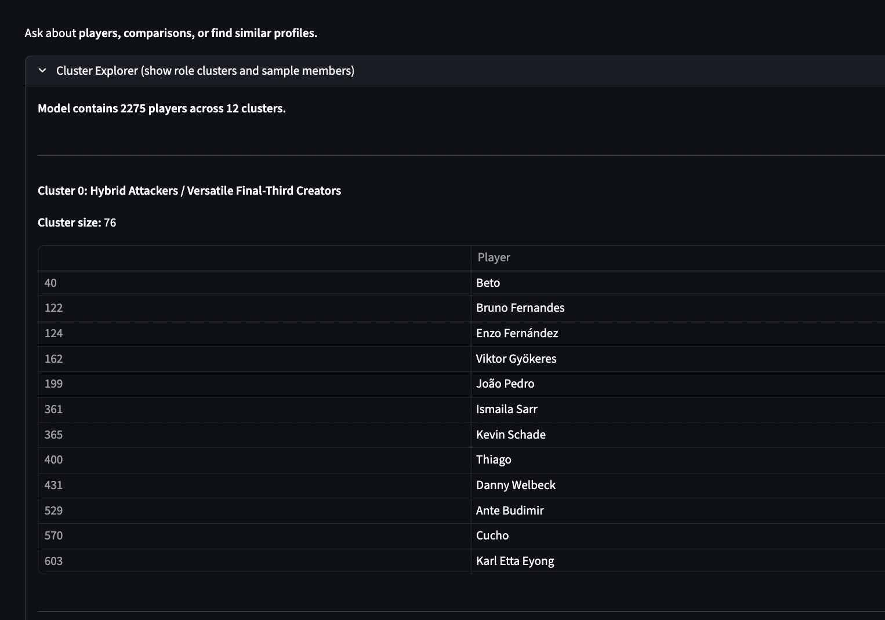
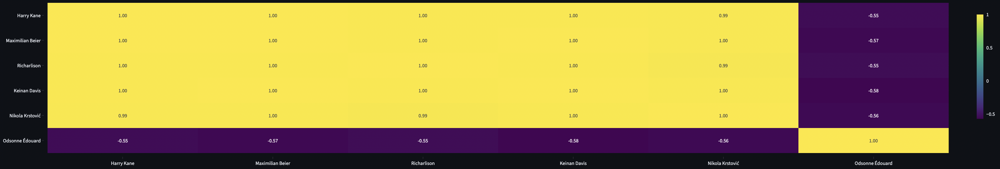

[](https://www.python.org/)
[](LICENSE)
[](https://streamlit.io)

# Soccer-Scouting-Bot

A concise, conversational scouting assistant for football (soccer) that
helps analysts quickly lookup players, find similar profiles, run
role-aware comparisons, and generate short scouting reports.

## Table of Contents
- [Soccer-Scouting-Bot](#soccer-scouting-bot)
	- [Table of Contents](#table-of-contents)
	- [Demo / Quick Start](#demo--quick-start)
	- [Features](#features)
	- [Why This Project?](#why-this-project)
	- [Prerequisites](#prerequisites)
	- [Installation](#installation)
	- [Usage](#usage)
	- [Technical Details](#technical-details)
		- [Data \& Feature Engineering](#data--feature-engineering)
		- [Embedding Model](#embedding-model)
		- [Similarity \& Comparison](#similarity--comparison)
		- [Radar Charts \& Visuals](#radar-charts--visuals)
	- [Frontend (Screenshots)](#frontend-screenshots)
	- [Limitations \& Next Steps](#limitations--next-steps)
	- [Troubleshooting](#troubleshooting)
	- [Contributing](#contributing)
	- [Authors](#authors)
	- [Our Paper (ACL)](#our-paper-acl)
	- [License \& Acknowledgements](#license--acknowledgements)

---

## Demo / Quick Start

Run these three commands to try the app locally (project root):

```bash
git clone https://github.com/shuklashreyas/Soccer-Scouting-Bot.git
cd Soccer-Scouting-Bot
pip install -r requirements.txt
streamlit run src/app/app.py
```

This should launch the Streamlit UI in your browser.

Live working app: https://shuklashreyas-soccer-scouting-bot-srcappapp-jewwpm.streamlit.app/

---

## Features

- Player lookup with fuzzy matching and metadata
- Embedding-based similarity search (StandardScaler → PCA → KMeans → cosine similarity)
- Frozen cluster labels describing tactical role archetypes
- Role-aware comparison engine (role sanity-check + z-score contrasts)
- Scouting report generator (HTML/markdown summaries)
- Lightweight NLP: entity extraction + intent classification
- Admin tools for editing and freezing cluster labels
- Graceful fallbacks when optional models are missing

---

## Why This Project?

- Problem: Analysts need a fast, interpretable way to find players and
  compare profiles across leagues and roles without heavy tooling.
- Target users: scouts, data analysts, coaches, and student researchers.
- Value: combines interpretable statistics (z-scores, percentiles) with
  compact explainable embeddings and conversational search.

---

## Prerequisites

- Python 3.10 or newer
- Optional: ChromeDriver (for Selenium scrapers)
- Recommended: virtual environment (venv or Conda)

---

## Installation

1. Clone repository (see Quick Start above)
2. Create and activate a virtualenv

```bash
python -m venv .venv
source .venv/bin/activate
```

3. Install Python deps

```bash
pip install -r requirements.txt
```

Notes:
- If you will run scraping or training, ensure system BLAS/LAPACK and
  appropriate drivers are installed for performance.

---

## Usage

- Start the app:

```bash
streamlit run src/app/app.py
```

- In the UI, ask natural queries like:
  - "Tell me about Erling Haaland"
  - "Compare Gakpo and Saka"
  - "Give me players similar to Declan Rice"

- Quick tips:
  - Use full or partial player names; the lookup is fuzzy.
  - If models are missing the app will show informative warnings and
    fall back to lighter-weight functions.

---

## Technical Details

### Data & Feature Engineering

- Source: FBref event-level tables (scraped and cleaned → `data/processed/`)
- Key transformations:
  - Normalize counts to per-90 rates when appropriate
  - Compute per-feature z-scores used for comparison and explanation

### Embedding Model

- Pipeline: `StandardScaler` → `PCA` (embeddings) → `KMeans` (role clusters)
- Persisted model: `data/models/player_embedding_model.pkl`
- Exposes: `X_scaled`, `embeddings`, `role_labels`, and `feature_cols`

### Similarity & Comparison

- Similarity: cosine similarity on PCA embeddings (top-k returned)
- Comparison engine (`src/modeling/compare.py`):
  - Role sanity-check to choose stat vs role comparison
  - Computes z-score differences, overlap, and produces textual summary

### Radar Charts & Visuals

- Radar charts show per-feature percentiles (0–100) for a player vs dataset
- Built with `mplsoccer` and rendered to images for Streamlit display

---

## Frontend (Screenshots)

Key UI screenshots (kept minimal for clarity):





Images are located in `images/`. Replace them by overwriting the PNG files.

---

## Limitations & Next Steps

- Limitations:
  - Uses only FBref event data (no tracking data)
  - Defender/goalkeeper comparisons are less reliable
  - Entity resolution depends on canonical player names and reasonable spelling
  - League-fit is currently a heuristic placeholder

- Next steps / future work:
  - Learned league-fit models and transfer outcome labels
  - Multi-season/time-aware embeddings
  - Tracking data integration for richer defensive metrics
  - RAG-based richer scouting prose and defender-specific features

---

## Troubleshooting

- "Streamlit fails to start" — make sure virtualenv is active and `streamlit` is installed.
- "Model file not found" — run `python -m src.modeling.train_player_embedding` to build `player_embedding_model.pkl`.
- "Selenium errors" — install ChromeDriver and ensure it's on your PATH.
- "Image rendering missing" — confirm `images/` contains `ui1.png`, `clusters.png`, `heatmap.png`.

If you hit errors, paste the stack trace into an issue and include your environment (Python version, OS).

---

## Contributing

- Contributions welcome: open an issue or submit a PR.
- Suggested workflow:
  1. Fork the repo
  2. Create a feature branch
  3. Add tests where appropriate
  4. Submit a PR with a clear description

Please follow existing code style and keep comments focused and minimal.

---

## Authors

- Ansh Marwa — [GitHub](https://github.com/anshm02) • [LinkedIn](https://www.linkedin.com/in/anshmarwa/)
- Komdean Masoumi — [GitHub](https://github.com/komdean) • [LinkedIn](https://www.linkedin.com/in/komdean/)
- Ethan Hsu — [GitHub](https://github.com/ethanhsu1) • [LinkedIn](https://www.linkedin.com/in/hsuethan/)
- Shreyas Shukla — [GitHub](https://github.com/shuklashreyas) • [LinkedIn](https://www.linkedin.com/feed/)
- Yossouf Bendary — [GitHub](https://github.com/youbendary) • [LinkedIn](https://www.linkedin.com/in/youssof-bendary/)

---

## Our Paper (ACL)

We published an accompanying paper for ACL. See the PDF in the repository:

- `ACL_SoccerScouting.pdf`

## License & Acknowledgements

- MIT License (see `LICENSE`)
- Data: FBref — follow FBref terms of use when scraping or publishing data
- Thanks to contributors and open-source libraries used (pandas, scikit-learn, Streamlit, mplsoccer)


